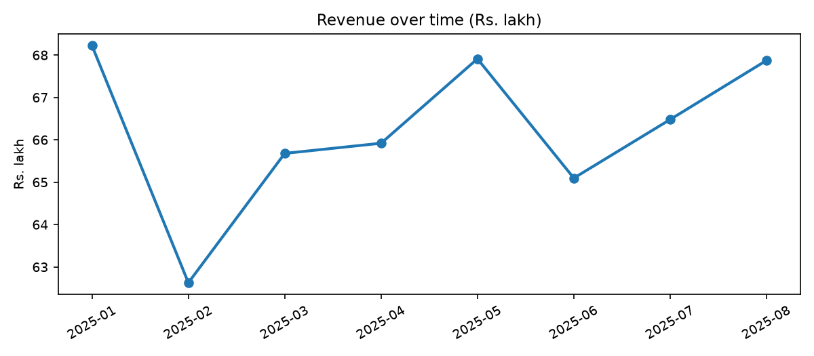
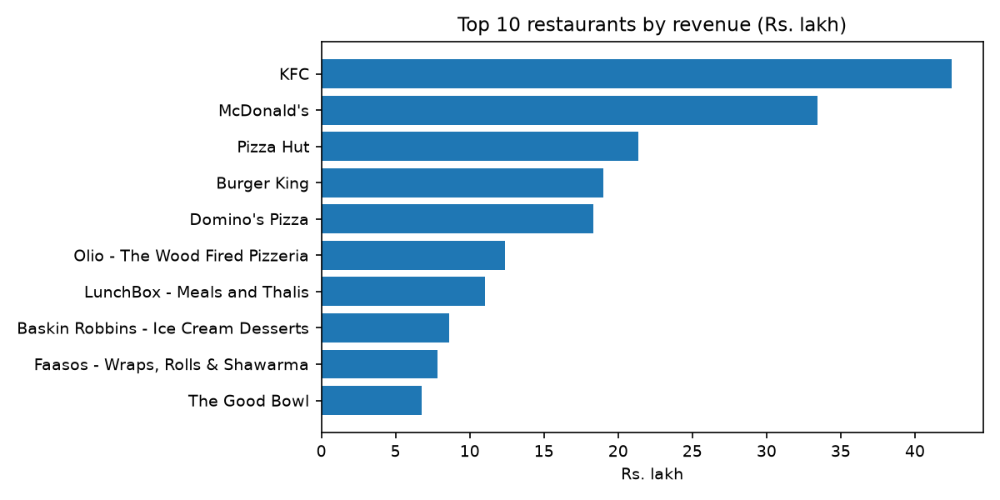
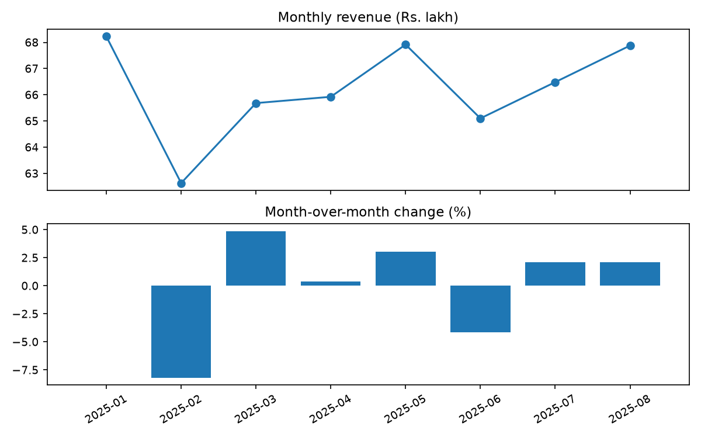

# Food Delivery Sales Analytics Dashboard

Analysis of Swiggy food orders with SQL, Python and Streamlit. Order records are cleaned with pandas, loaded into SQLite, and presented in a filterable dashboard by restaurant, dish, city and category.

## Background

The data covers food delivery orders across Indian cities from January to August 2025. The main questions are:

1. Which restaurants contribute the most revenue?
2. How does revenue move month to month?
3. Which dishes and cities perform best?
4. Which categories lead, and how many outlets have gone inactive?

This repository contains the data preparation, SQL analysis and dashboard used to answer those questions.

## Dataset

- Source file (not committed, see data/README_DATA.md): Swiggy orders, tab-separated, 197,490 raw rows
- Period: 01-Jan-2025 to 31-Aug-2025. Each row is one order line for one dish.
- Columns: State, City, OrderDate, DayOfWeek, Quarter, WeekNo, Restaurant, Area, Category, Item, VegType, Price, Rating, RatingCount
- Coverage: 28 cities including Bengaluru, Lucknow, Hyderabad, Mumbai and New Delhi. 993 restaurants.

## Method

```
Raw TXT in data/
  -> src/data_prep.py for cleaning and Revenue calculation
  -> data/retail.db, table orders
  -> sql/01 to 06 for the analysis
  -> app.py for the dashboard
```

Cleaning applied in src/data_prep.py:

| Rule | Reason |
|------|--------|
| Exclude rows missing Restaurant, Item or City | Core dimensions for all analyses |
| Exclude Price missing or <= 0 | Revenue would be invalid |
| Parse OrderDate, exclude bad dates | Required for trend and recency |
| Revenue equals Price | One row is one order line |

Running python -m src.data_prep prints row counts before and after each step.

## Findings

Results from the current database build:

- Records: 197,490 raw, 197,364 after cleaning (99.94%). 2 rows with missing keys and 124 rows with invalid prices were removed. Total revenue Rs.52,984,174.39 across 197,364 order lines, 993 restaurants and 28 cities.
- Top restaurant: McDonald's in Bengaluru with Rs.516,113.77 across 2,032 lines, followed by KFC in Ahmedabad (sql/01_top_restaurants.sql).
- Trend: January 2025 was highest at Rs.6,822,566.03. Monthly movement from February to August stayed within a narrow band, with the largest change in February at minus 8.2 percent (sql/02_monthly_revenue_trend.sql).
- Dishes: demand is spread across 56,521 distinct items. Highest was Chicken Supreme Thin n Crispy at Rs.63,583.00, 0.12 percent of revenue (sql/03_top_products.sql).
- Cities: Bengaluru leads at 10.30 percent (Rs.5,456,798.41), followed by Lucknow, Hyderabad, Mumbai and New Delhi. Demand is balanced across cities (sql/04_revenue_by_city.sql).
- Categories: Recommended leads at 13.57 percent (Rs.7,187,808.53), followed by Main Course. Veg accounts for Rs.34,558,176.29 against Non-Veg Rs.18,425,998.10. Outlet inactivity, defined as no record in the 90 days before the latest order date, is 9 of 1,598 restaurant-city outlets (sql/05_repeat_vs_onetime.sql, sql/06_churn.sql).

Each section of the dashboard includes the chart, the underlying table and the SQL used.

## Screenshots





## Running the project

```bash
cd "Food-Delivery-Sales-Analytics-Dashboard"
pip install -r requirements.txt
python -m src.data_prep --raw "data/SWIGGY DATA.txt"
streamlit run app.py
```

Open http://localhost:8501 and use the sidebar to set the date range and cities.

A single query can also be run directly:

```bash
sqlite3 data/retail.db < sql/02_monthly_revenue_trend.sql
```

## Deployment

The database file and raw TXT are not committed as they are large.

1. The repo includes `data/cleaned_orders_sample.csv`, a stratified sample
   (13,440 rows across all months and cities). The app builds `retail.db`
   from it automatically on startup, so the hosted demo works with no setup.
2. Push to GitHub.
3. Deploy on Streamlit Community Cloud with main file app.py.

## Limitations

- The file has no CustomerID, so customer-level repeat and churn analysis is not possible. Outlet recency is used instead.
- The file has no order identifier, so each row is treated as one order line. Order totals are line counts.
- Each row carries a single rating value tied to the line. Averages are indicative.
- The data covers January to August 2025 only.
- Revenue is gross item price. The file contains no delivery fees, discounts or costs.
- SQLite is used as a single-file store, suitable for this data volume.

## Structure

```
Food-Delivery-Sales-Analytics-Dashboard/
├── app.py
├── requirements.txt
├── .streamlit/config.toml
├── data/
├── sql/
└── src/
    ├── data_prep.py
    └── query_helpers.py
```

## Implementation notes

- Common table expressions were used to keep the SQL readable. The monthly trend uses LAG for prior-month comparison.
- Dashboard queries use parameter placeholders throughout.
- The custom query section accepts SELECT statements only and limits output to 200 rows.
